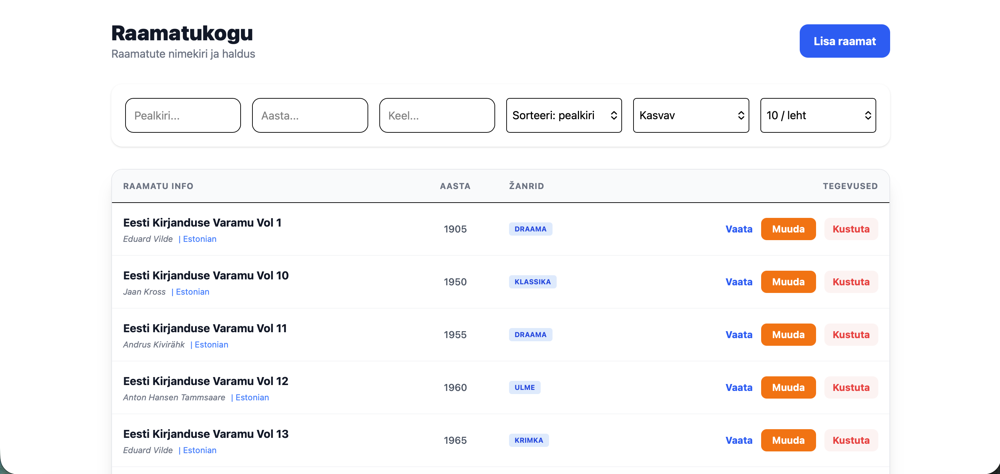
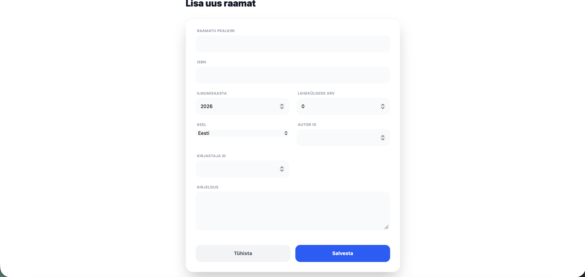
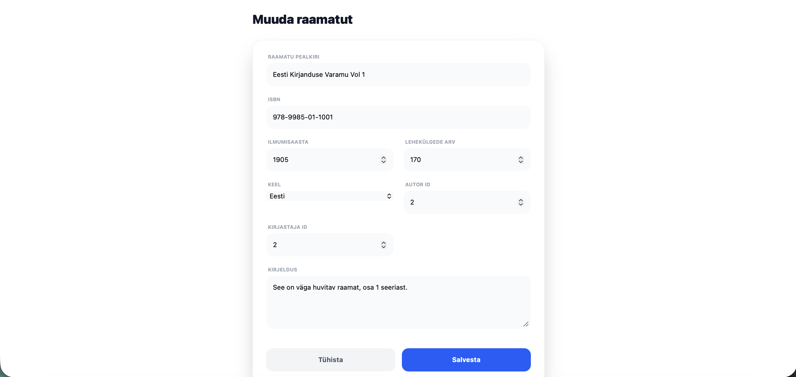

# Raamatukogu (React + Vite)

Veebirakendus raamatute haldamiseks. Kasutaja saab lisada, vaadata, muuta ja kustutada raamatuid.

---

## Autorid ja tööjaotus

Allan Adamson

* Frontend arendus (React + Vite)
* API ühendamine
* Kasutajaliides
* Deploy GitHub Pages

---

## Backend

Backend API on saadaval:
https://raamatukogu.onrender.com/api/v1/books

Backend töötab Render platvormil.

---

## Repositoorium

https://github.com/allanadamson/Raamatukogu

---

## Live demo

Rakendust saab kasutada siin:
https://allanadamson.github.io/Raamatukogu/#/books

---

## Installatsioon

1. Klooni projekt:

git clone https://github.com/allanadamson/Raamatukogu.git

2. Liigu projekti kausta:

cd Raamatukogu

3. Liigu Frontend kausta:

cd Frontend

4. Paigalda sõltuvused:

npm install

5. Loo .env fail:

cp .env.example .env

---

## Keskkonnamuutujad

Failis `.env` peab olema:

VITE_API_URL=https://raamatukogu.onrender.com/api/v1

---

## Käivitamine

Arendusrežiimis:

npm run dev

Ava brauseris:
http://localhost:5173

---

## Build

npm run build

---

## Ekraanipildid

### Avaleht

### Raamatu lisamine

### Raamatu muutmine

---

## Projekti struktuur

.
├── Frontend
│   ├── src
│   ├── public
│   └── ...
├── Backend
├── screenshots
│   ├── home.png
│   ├── add.png
│   └── edit.png
├── .env.example
├── .gitignore
├── README.md

---

## .env.example

VITE_API_URL=https://raamatukogu.onrender.com/api/v1

---

## .gitignore

node_modules
dist
.env
